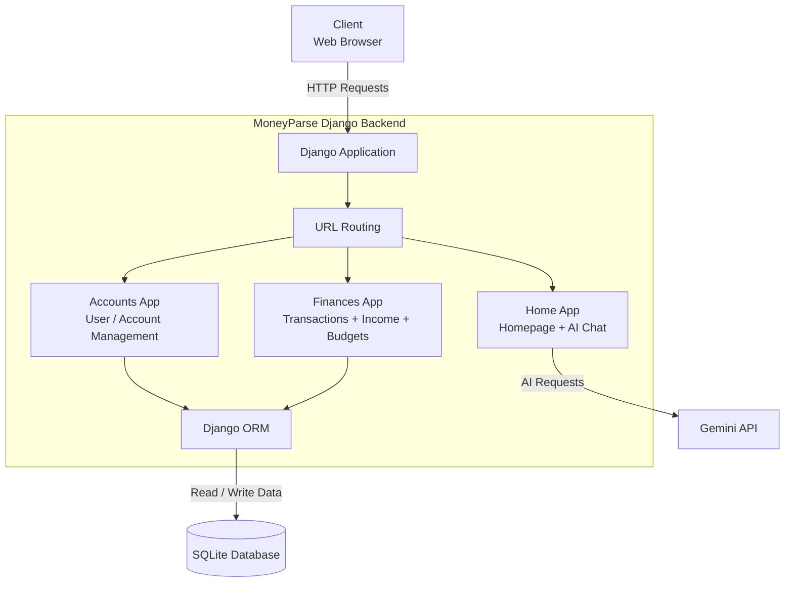

## Architecture

```mermaid
flowchart TB
    Client["Client<br/>Web Browser"]

    subgraph MoneyParse["MoneyParse Django Backend"]
        Django["Django Application"]

        Routing["URL Routing"]

        Home["Home App<br/>Homepage + AI Chat"]
        Accounts["Accounts App<br/>User / Account Management"]
        Finances["Finances App<br/>Transactions + Income + Budgets"]

        ORM["Django ORM"]
    end

    DB[("SQLite Database")]
    Gemini["Gemini API"]

    Client -->|"HTTP Requests"| Django
    Django --> Routing

    Routing --> Home
    Routing --> Accounts
    Routing --> Finances

    Accounts --> ORM
    Finances --> ORM

    ORM -->|"Read / Write Data"| DB

    Home -->|"AI Requests"| Gemini
```
